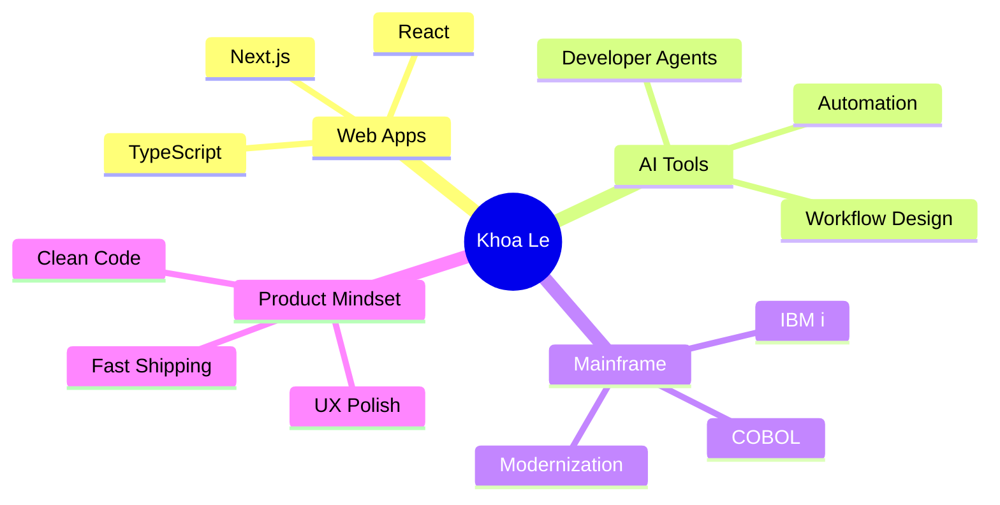

<div align="center">

# Hi, I'm Khoa Le 👋

### 🚀 Developer • Builder • Mainframe Explorer


<br />

<a href="https://github.com/thienkhoalew">
  
</a>
<a href="https://github.com/thienkhoalew?tab=followers">
  
</a>
<a href="https://github.com/thienkhoalew?tab=repositories">
  
</a>

</div>

---

## ✨ About Me

```yaml
name: Le Thien Khoa 
username: thienkhoalew
focus: Web Development, AI Tools, Mainframe Learning
current_workspace: Building practical apps and developer workflows
mindset: Learn fast, build clean, ship better
```

- 🔭 Working on **AI-assisted developer tools** and **web applications**
- 🌱 Exploring **Python**, **TypeScript**, **React**, **Next.js**, and **mainframe systems**
- 🧠 Interested in clean UX, automation, and tools that save time
- ⚡ Goal: turn ideas into polished products

---

## 🧰 Tech Stack

<div align="center">

### Languages


### Frameworks & Tools


</div>

---

## 📊 GitHub Stats

<div align="center">


<br />
<br />


<br />
<br />


</div>

---

## 🏆 Featured Projects

<table>
  <tr>
    <td width="50%">
      <a href="https://github.com/thienkhoalew/agent-mainframe">
        <h3>🖥️ agent-mainframe</h3>
      </a>
      <p>AI-assisted toolchain for mainframe workflows and developer productivity.</p>
      <p>
        
        
        
      </p>
    </td>
    <td width="50%">
      <a href="https://github.com/thienkhoalew/shop-manager">
        <h3>🛒 shop-manager</h3>
      </a>
      <p>Modern shop management app with clean dashboard and practical business tools.</p>
      <p>
        
        
        
      </p>
    </td>
  </tr>
  <tr>
    <td width="50%">
      <a href="https://github.com/thienkhoalew/react-point-game">
        <h3>🎮 react-point-game</h3>
      </a>
      <p>Interactive React point game deployed on Vercel with lightweight gameplay.</p>
      <p>
        
        
        
      </p>
    </td>
    <td width="50%">
      <a href="https://github.com/thienkhoalew/screen_test_next">
        <h3>🧪 screen_test_next</h3>
      </a>
      <p>Next.js screen testing playground for UI experiments and frontend practice.</p>
      <p>
        
        
        
      </p>
    </td>
  </tr>
</table>

---

## 🌐 Live Apps

| Project | Demo | Stack |
|---|---|---|
| **React Point Game** | [react-point-game.vercel.app](https://react-point-game.vercel.app) | JavaScript, React |
| **Shop Manager** | [shop-manager-one.vercel.app](https://shop-manager-one.vercel.app) | TypeScript, Web App |

---

## 🎯 2026 Focus



---

## 🤝 Connect

<div align="center">

<a href="https://github.com/thienkhoalew">
  
</a>
<a href="https://www.facebook.com/thienkhoalewlew">
  
</a>
<a href="https://www.youtube.com/@thienkhoalewlew6267">
  
</a>
<a href="https://zalo.me/0384064124">
  
</a>

<br />
<br />


</div>
