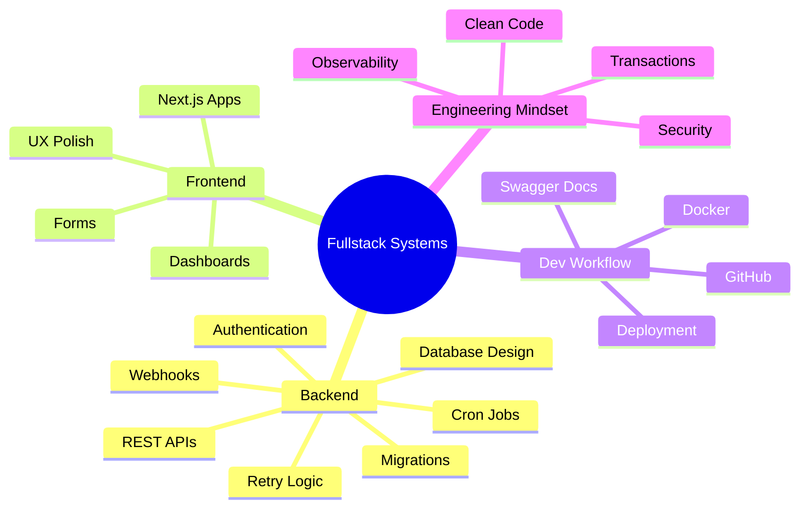
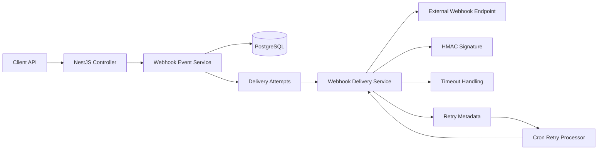
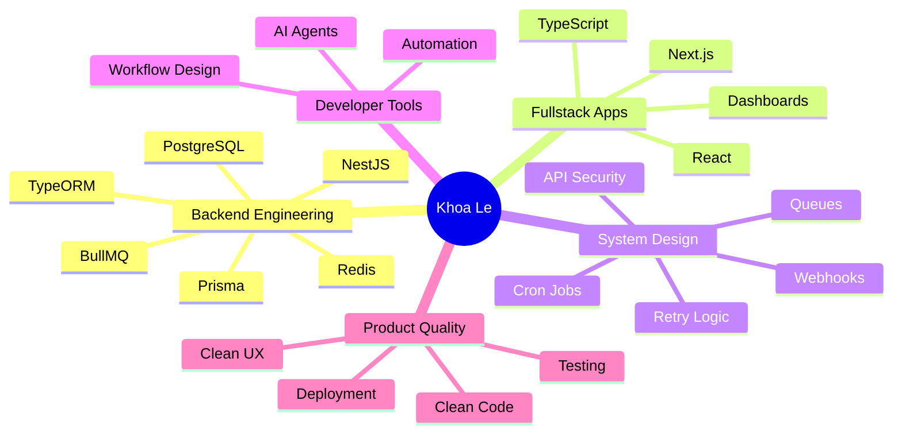

<div align="center">

# Hi, I'm Khoa Le 👋

### 🚀 Fullstack Developer • Backend-focused • NestJS / Next.js / PostgreSQL


<br />

<a href="https://github.com/thienkhoalew">
  
</a>
<a href="https://github.com/thienkhoalew?tab=followers">
  
</a>
<a href="https://github.com/thienkhoalew?tab=repositories">
  
</a>

</div>

---

## ✨ About Me

```yaml
name: Le Thien Khoa
username: thienkhoalew
role: Fullstack Developer
focus: Backend Engineering, API Design, Fullstack Web Apps
core_stack: TypeScript, NestJS, Next.js, PostgreSQL, Docker
current_goal: Build production-ready fullstack systems with clean backend architecture
mindset: Understand deeply, build cleanly, ship consistently
```

- 🔭 Building **fullstack applications** with **NestJS**, **Next.js**, and **PostgreSQL**
- 🧠 Backend-focused: API design, database modeling, migrations, webhooks, queues, cron jobs
- ⚙️ Interested in scalable systems, clean architecture, automation, and developer tools
- 🌱 Learning deeper backend engineering: transactions, retries, security, observability, and deployment
- 🚀 Goal: become a strong fullstack developer with serious backend fundamentals

---

## 🧰 Tech Stack

<div align="center">

### Core Languages


### Backend


### Frontend


### Tools


</div>

---

## 🏗️ What I Build



---

## 🚀 Featured Fullstack Projects

<table>
  <tr>
    <td width="50%">
      <a href="https://github.com/thienkhoalew/webhook">
        <h3>🔔 Webhook Manager</h3>
      </a>
      <p>
        Backend-focused webhook delivery system built with NestJS, PostgreSQL, TypeORM, Docker, and Swagger.
        Supports subscriptions, event dispatching, HMAC signatures, retries, cron processing, migrations,
        and safe API responses.
      </p>
      <p>
        
        
        
        
      </p>
    </td>
    <td width="50%">
      <a href="https://github.com/thienkhoalew/smart_task_manager">
        <h3>🧠 Smart Task Manager</h3>
      </a>
      <p>
        Fullstack productivity app using Next.js and TypeScript with AI-assisted task breakdown,
        task management workflows, and clean frontend architecture.
      </p>
      <p>
        
        
        
      </p>
    </td>
  </tr>
  <tr>
    <td width="50%">
      <a href="https://github.com/thienkhoalew/shop-manager">
        <h3>🛒 Shop Manager</h3>
      </a>
      <p>
        Business management web app focused on clean dashboards, practical workflows,
        and fullstack product thinking.
      </p>
      <p>
        
        
        
      </p>
    </td>
    <td width="50%">
      <a href="https://github.com/thienkhoalew/agent-mainframe">
        <h3>🖥️ Agent Mainframe</h3>
      </a>
      <p>
        Developer toolchain for mainframe workflows, exploring AI-assisted productivity,
        parser tooling, and modernization concepts.
      </p>
      <p>
        
        
        
      </p>
    </td>
  </tr>
</table>

---

## 🔔 Current Backend Project: Webhook Manager



### Features implemented

- ✅ Webhook subscriptions
- ✅ Event creation
- ✅ Delivery attempts
- ✅ HTTP webhook dispatch
- ✅ HMAC SHA256 signature
- ✅ Fetch timeout with `AbortController`
- ✅ Retry policy with `nextRetryAt`
- ✅ Cron-based retry processor
- ✅ Event status aggregation
- ✅ TypeORM migrations
- ✅ PostgreSQL indexes
- ✅ Safe responses without leaking secrets
- ✅ Swagger API documentation

---

## 📊 GitHub Stats

<div align="center">


<br />
<br />


<br />
<br />


</div>

---

## 🎯 2026 Focus



---

## 🌐 Live Apps

| Project | Demo | Stack |
|---|---|---|
| **React Point Game** | [react-point-game.vercel.app](https://react-point-game.vercel.app) | JavaScript, React |
| **Shop Manager** | [shop-manager-one.vercel.app](https://shop-manager-one.vercel.app) | TypeScript, Web App |

---

## 🤝 Connect

<div align="center">

<a href="https://github.com/thienkhoalew">
  
</a>
<a href="https://www.facebook.com/thienkhoalewlew">
  
</a>
<a href="https://www.youtube.com/@thienkhoalewlew6267">
  
</a>
<a href="https://zalo.me/0384064124">
  
</a>

<br />
<br />


</div>
